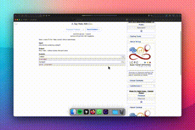

# Codeforces++ 🚀

Hey, competitive programmer! **Codeforces++** is a Tampermonkey userscript that transforms your Codeforces experience into a modern coding powerhouse. Navigate problems, copy statements, watch tutorials, get AI help, and code directly on the page with a VS Code-like editor—all from one incredible interface. Ready to level up your competitive programming game?

## 🎬 Demo



## ✨ Features

### 🖥️ **Monaco VS Code Editor**

-   **Full VS Code Experience**: Code directly on Codeforces with Monaco Editor—the same engine that powers VS Code!
-   **Smart Syntax Highlighting**: Beautiful syntax highlighting with semantic analysis for C++, Python, Java, JavaScript, and C.
-   **Premium Fonts**: Cascadia Code, JetBrains Mono, and other developer favorites for the perfect coding experience.
-   **One-Click Submission**: Submit solutions directly from the editor with preview confirmation—no more copy-pasting!
-   **Instant Paste**: Paste code from clipboard with a single button click.
-   **Language Switching**: Quick language selector with auto-templates for each programming language.
-   **Dark Theme**: Modern dark interface with a beautiful blue gradient header that matches your coding vibe.

### 🧭 **Navigation & Productivity**

-   **Problem Navigation**: Switch between problems with **Previous** and **Next** buttons.
-   **Copy Problem Statement**: Grab the whole problem (with examples!) in one click.
-   **Enhanced Submission Form**: Preview your code before submitting with our smart submission system.

### 🎓 **Learning & Tutorials**

-   **Solutions & Tutorials**: Find video help for the problem instantly.
-   **AI Explanations**: Understand problems better with:
    -   Perplexity AI coaching
    -   ChatGPT detailed breakdowns
-   **Coding Tools**: Quick access to essential development tools:
    -   Excalidraw whiteboard for algorithm visualization
    -   Online compilers for quick testing

### 🎨 **Modern Design**

-   **Beautiful Dark Theme**: Sleek modern interface with carefully chosen colors and gradients.
-   **Responsive Design**: Works perfectly with Codeforces sidebar and adapts to any screen size.
-   **Smooth Animations**: Polished hover effects and transitions for a premium feel.
-   **Smart Notifications**: Elegant sliding notifications instead of annoying popups.

(No API key needed!)

## 🛠️ Installation

1.  Install the Tampermonkey extension for your browser:

    [](https://chromewebstore.google.com/detail/tampermonkey/dhdgffkkebhmkfjojejmpbldmpobfkfo?hl=en)
    [](https://addons.mozilla.org/en-US/firefox/addon/tampermonkey/)

2.  Click the Tampermonkey icon in your browser and select **"Create a new script"**.
3.  Clear any existing text in the editor.
4.  Go to the `tamper.js` file in this repository, **copy its entire content**, and paste it into the Tampermonkey editor.
5.  Hit **Ctrl+S** (or File → Save) to save the script.

**Tip**: Double-check Tampermonkey is turned on!

## 📖 Usage

Visit a Codeforces problem page, and the magic happens:

### 💻 **VS Code Editor**

-   **Code Like a Pro**: A beautiful Monaco editor appears right under the problem statement—code without leaving the page!
-   **Smart Language Selection**: Pick your language (C++, Python, Java, etc.) and get starter templates automatically.
-   **📋 Paste Button**: Click to paste code from your clipboard instantly.
-   **🚀 Submit Button**: Submit your solution with a preview confirmation—never worry about wrong submissions again!

### 🧭 **Enhanced Navigation**

-   **Navigation Buttons**: See **Previous** and **Next** at the top—jump between problems like a speedster.
-   **Codeforces++ Sidebar**: A sleek sidebar with power tools:
    -   **Copy Problem**: Copies everything to your clipboard for notes.
    -   **Solutions Tutorials**: Opens YouTube with problem-related videos.
    -   **Perplexity Explain/ChatGPT Explain**: Get expert explanations to boost your understanding!

### 🎨 **Visual Experience**

-   **Dark Theme Magic**: Everything looks modern and easy on the eyes.
-   **Responsive Design**: Perfect fit whether you're on a laptop, desktop, or ultrawide monitor.
-   **Smooth Interactions**: Hover effects, animations, and polished UI make coding enjoyable.

**Note**: AI and YouTube need internet, but the script keeps your data private and never sends your code anywhere.

## 🔍 How It Works

Here's the tech magic behind Codeforces++:

-   **Monaco Editor Integration**: Uses the same editor engine as VS Code for professional coding experience.
-   **Smart DOM Manipulation**: Seamlessly integrates with Codeforces' existing interface.
-   **Enhanced Submission System**: Intercepts and improves the standard submission flow with previews.
-   **Responsive Width Calculation**: Automatically adjusts to fit alongside Codeforces' sidebar.
-   **Modern CSS Design**: Custom color palette with gradients, shadows, and smooth transitions.
-   **Memory Management**: Proper cleanup prevents performance issues during long coding sessions.

It's all vanilla JavaScript with Monaco—fast, professional, and reliable!

## 🤖 AI Learning Help

The script transforms AI tools into your personal competitive programming coach! Instead of just giving answers, it helps you understand problems deeply and develop problem-solving skills.

## 👨‍🏫 AI Coach Prompts

Here's the expert prompt that turns ChatGPT and Perplexity into your coding sensei:

```
You are an expert competitive programming coach with decades of experience. Your goal is to explain this problem clearly and help the user understand how to approach it, without providing any actual code solution.

Please analyze this problem and provide:
1. A clear explanation of what the problem is asking in simple terms with examples
2. Identify the key constraints and requirements that will impact your solution approach
3. Break down the problem into smaller, more manageable parts with a step-by-step plan
4. Suggest 2-3 potential approaches or algorithms that could work, explaining the tradeoffs of each
5. Explain the time and space complexity considerations of each approach
6. Point out potential edge cases or tricky aspects of the problem that might lead to bugs
7. Explain any mathematical concepts, formulas, or theorems needed to understand the problem
8. Provide a visual explanation with a diagram, graph, or flowchart to help understand the problem
9. Use simple, friendly language appropriate for someone with basic programming knowledge (A2-B1 level)
10. Include 1-2 hints that guide toward the solution without giving it away completely

Remember, do NOT provide any actual code in your response, just guide the user toward understanding the problem and developing their own solution approach.
```

This prompt is carefully crafted to make you a better programmer, not just someone who copies solutions. The AI becomes your coding mentor!

## 🎨 Color Palette & Theming

Codeforces++ uses a carefully designed modern dark theme:

-   **Background**: Deep dark (#0E0E0E) for comfortable long coding sessions
-   **Cards & Containers**: Rich dark (#121212) with subtle borders
-   **Primary Actions**: Beautiful blue gradient (#00A4FF → #0090FF)
-   **Text**: High contrast white and grays for perfect readability
-   **Shadows**: Layered shadows for depth and modern feel

The design is inspired by modern IDEs and follows accessibility best practices!

## 🌐 Where It Works

These Codeforces pages are fully supported:

-   `https://codeforces.com/contest/*/problem/*`
-   `https://codeforces.com/problemset/problem/*/*`
-   `https://codeforces.com/gym/*/problem/*`
-   `https://codeforces.com/group/*/contest/*/problem/*`
-   `https://codeforces.com/edu/*/problem/*`

## 🚀 What's Next?

Exciting future plans:

-   **More IDE Features**: Auto-complete, error highlighting, and code formatting
-   **Platform Expansion**: AtCoder, LeetCode, and other competitive programming sites
-   **Offline Coding**: Save and sync your solutions across devices
-   **Community Features**: Share and discuss approaches with other coders
-   **Performance Analytics**: Track your coding patterns and improvement areas

**Got cool ideas?** We'd love to hear them!

## 🛡️ Troubleshooting

-   **Editor not showing?** Refresh the page and make sure Tampermonkey is enabled.
-   **Submit button not working?** Check browser console for errors and try refreshing.
-   **Monaco editor looks weird?** Your browser might be blocking the CDN—try disabling ad blockers temporarily.
-   **AI explanations stuck?** Check your internet connection and try again.
-   **Buttons missing?** Make sure you're on a supported Codeforces problem page.

## 📄 License

MIT - Feel free to fork, modify, and make it even more awesome!
